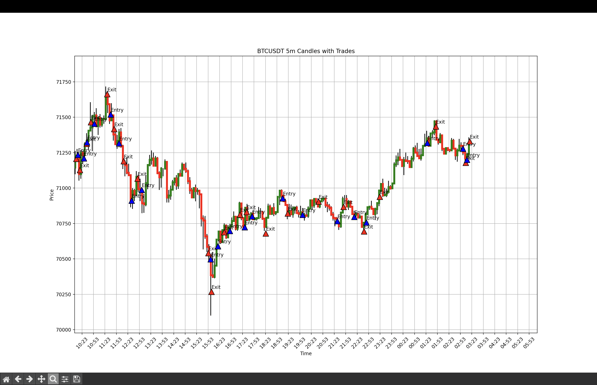

# Telegram Channel Trade Analyzer

This project involves building a tool that extracts trade information from a specific Telegram channel, processes the trade data, and fetches corresponding candlestick data from the Binance API to visualize the trades on a chart. The tool includes functionalities for handling API rate limits, saving data locally, and ensuring efficient data retrieval.

**This project covers the trades made from the very beginning until Sat Jun 08 2024 16:20:05 UTC TIME**

## Features

1. **Telegram Client Initialization**: Connects to Telegram using user API credentials.
2. **Message Extraction**: Fetches all messages from a specified Telegram channel.
3. **Trade Parsing**: Parses messages to extract trade entry and exit information.
4. **Trade Storage**: Saves extracted trade data to `trades.json`.
5. **Candle Fetching**: Fetches candlestick data from Binance API based on trade times.
6. **Rate Limiting**: Ensures compliance with Binance API rate limits.
7. **Data Visualization**: Plots trades on a candlestick chart.

## Requirements

- Python 3.7+
- Telethon
- Requests
- Matplotlib

## Installation

1. Clone the repository:
    ```bash
    git clone https://github.com/devopslp/telegram-trade-analyzer.git
    cd telegram-trade-analyzer
    ```

2. Install the required Python packages:
    ```bash
    pip install telethon requests matplotlib
    ```

3. Set up your Telegram API credentials:
    - Obtain your API ID and Hash from [my.telegram.org](https://my.telegram.org).
    - When you run the script for the first time, it will prompt you to enter your API ID and Hash. You can simply copy-paste them when requested. It will automatically create a file like this:
      ```json
      {
          "api_id": "YOUR_API_ID",
          "api_hash": "YOUR_API_HASH"
      }
      ```

## Usage
### Fresh start

You can delete messages.json, candles.json and trades.json to obtain a new fresh data (most recent) from the channel

Please note that YOU MUST be Joined to [Octobits TRADING CHANNEL](https://t.me/+SGKllWVD6yQ5NjVk)

Also you need to create your OWN new channel and get the CHANNEL_ID to get the reports on your own channel and changed it in the code: `TARGET_CHANNEL_IDENTIFIER` make sure the ID is within simple quotes `''`

### Running the Script

1. Ensure your `config.json` file contains your Telegram API credentials.
2. Run the main script:
    ```bash
    python app.py
    ```

### What the Script Does

1. **Connects to Telegram**:
    - Initializes the Telegram client using API credentials from `config.json`.
    - Authenticates the user via a phone number and verification code if not already authenticated.

2. **Creates a WebSocket connection to listen new messages and adds them to trades.json**:
    - Initialize a event listener to look for incoming new trades.
    - Updates the `trades.json` file.
    - Send a message to `REPORT_CHANNEL_ID` once it's received

3. **Extracts Messages**:
    - Fetches all messages from the specified Telegram channel.
    - Processes each message to extract trade entry and exit information.

4. **Handles API Rate Limits**:
    - Binance API requests are rate-limited to 24 requests per minute (one request every 2.5 seconds) to comply with the 2400 weight per minute limit.

5. **Fetches Candlestick Data**:
    - Based on the entry and exit times of trades, fetches the required candlestick data from the Binance API.
    - Stores fetched candlestick data in `candles.json` to avoid redundant API calls.

6. **Plots Trades on Candlestick Chart**:
    - Visualizes the trades on a candlestick chart, marking the entry and exit points for each trade.

## File Descriptions

- **config.json**: Stores Telegram API credentials.
- **trades.json**: Stores extracted trade data with entry and exit details.
- **candles.json**: Stores fetched candlestick data from Binance.

## Rate Limiting Considerations

- **Binance API**: 
  - Limit of 2400 request weight per minute.
  - Each `/fapi/v1/klines` request has a weight of 10.
  - The script limits requests to 24 per minute (one every 2.5 seconds) to stay within the limit.

## Important Notes

- Ensure the Telegram API credentials are correct and have sufficient permissions to access the specified channel.
- The channel identifier must be valid and accessible by the user account.
- The script fetches and processes messages in batches to handle large volumes efficiently.
- Ensure the `trades.json` and `candles.json` files are writable and located in the script's directory.

## Example Visualization

After running the script, an example candlestick chart with marked trade entries and exits will be displayed, similar to the following:



## Future Enhancements

- Add support for multiple timeframes for candlestick data.
- Implement error handling for network-related issues.
- Enhance visualization with more detailed trade annotations.

## Report Generation

A separate script `report.py` is provided to analyze and report the trading performance after fetching the trade data.

### Usage of report.py

1. Ensure the `trades.json` file is available and up-to-date.
2. Run the `report.py` script:
    ```bash
    python report.py
    ```

### Editable Parts in report.py

- **Initial Investment**: Modify the `INITIAL_INVESTMENT` constant to set the initial amount invested in USDT.
- **Investment Percentage**: Change the `INVESTMENT_PERCENTAGE` constant to adjust the percentage of the initial investment used for each trade.
- **Leverage**: Adjust the `LEVERAGE` constant to set the leverage for futures trading.
- **Trade Fee Percentages**: Update `TRADE_FEE_PERCENTAGE_MAKER` and `TRADE_FEE_PERCENTAGE_TAKER` to reflect the maker and taker fee percentages.

## Contributions

Contributions are welcome! Please feel free to submit a Pull Request.

## License

This project is licensed under the MIT License.